Many thanks to the readers who pointed out real issues in the original code and article:

- [Alexis Payen](https://dev.to/alexis_payen_d66d3be3214d) — for the [dev.to comment](https://dev.to/alexis_payen_d66d3be3214d/comment/2i4ke) explaining why `std::shared_ptr` was outperforming my implementation (the move constructor was doing an unnecessary `acquire` + `reset`, and `refcount++` was implicitly `seq_cst`).
- [Derrick Lyndon Pallas](https://github.com/pallas) — for [issue #1](https://github.com/agutikov/faa_vs_cmpxchg/issues/1) pointing out that `compare_exchange` already writes the observed value back into `expected` on failure (the explicit `load()` inside the retry loop is redundant), and that `seq_cst` is stronger than refcount decrement requires.

Both pointers led me to revisit the rest of the memory ordering as well.
The code is now both more correct and noticeably faster; the charts below were re-run with the fixes applied.

---


* [Differences and similarity](#ds)
* [Benchmarks](#bench)
 * [`shared_ptr` implementaion](#shared_ptr_impl)
 * [`spinlock` implementation](#spinlock_impl)
 * [Benchmark for `shared_ptr`](#shared_ptr_bench)
 * [Benchmark for `spinlock`](#spinlock_bench)
 * [Measurements](#metrics)
* [Resulting charts for `refcount`](#results_refcount)
* [Resulting charts for `spinlock`](#results_spinlock)
* [Conclusion](#conclusion)

C++ has out of the box cross-platfrorm atomic operations since C++11.

There are several types of [atomic operations](https://en.cppreference.com/w/cpp/atomic).
Here I want to compare 2 types of them:
- `atomic_fetch_add`, `atomic_fetch_sub`, etc...
- `atomic_compare_exchange`

This kind of atomic ops existed in computer programming long before C++11.
For example [Compare-and-swap (CAS)](https://en.wikipedia.org/wiki/Compare-and-swap) and [Fetch-and-add (FAA)](https://en.wikipedia.org/wiki/Fetch-and-add) where implemented as CPU instructions in Intel 80486 - [CMPXCHG and XADD](https://en.wikipedia.org/wiki/X86_instruction_listings#Added_with_80486).

Here I will not talk about origin of atomic operations and problem they are designed to solve - data races.

Here I want to concentrate only on next 2 points:
1. Comparison of semantic and typical use cases of atomic CAS and FAA.
2. Comparison of performance of CAS and FAA in typical and abnormal cases.


## Differences and similarity <a name="ds"></a>

Most understandable description of atomic operation that I know is equivalent code:
```C++
int atomic_fetch_add(int* target, int add)
{
    int old = *target;
    *target += add;
    return old;
}

bool atomic_compare_exchange(int* target, int* expected, int desired)
{
    if (*target == *expected) {
        *target = desired;
        return true;
    }
    return false;
}
```

Difference in behaviour:

| `compare_exchange` | `fetch_add`
| ---- | ---
| can fail | can't fail - always succeeds
| leaves memory unchanged if fails | always changes memory
| succeeds only within narrow contition - equality of values pointed to by `target` and `expected` | rollback of changes requires another memory write operation
| implies a loop of retries | no loops 

Both `compare_exchange` and `fetch_add` are equivalent, in the sense that it is possible to define (implement) one through another. 
But differences are huge and sometimes (you'll see) usage of inappropriate atomic operation leads to significant performance impact up to complete inoperability of program.


Basic use cases:

| `compare_exchange` | `fetch_add`
| ---- | ---
| program thread waits for some changes made by the other thread | program thread can continue progress in any case
| lock, mutual exclusion (mutex) | atomic counter, refcounter (shared_ptr, ...)


## Benchmarks <a name="bench"></a>

Basically, implemented `shared_ptr` and `spinlock` each with both `compare_exchange` and `fetch_add`.
And compared their performance under **aggressive** **concurrent** read/write access.
Also compared to standard [`std::mutex`](https://en.cppreference.com/w/cpp/thread/mutex) and [`std::shared_ptr`](https://en.cppreference.com/w/cpp/memory/shared_ptr).
Code: https://github.com/agutikov/faa_vs_cmpxchg

### `shared_ptr` implementaion <a name="shared_ptr_impl"></a>

Instead of posting complete code of `shared_ptr` here, I provide just difference between two implementations.
Main part is **decrement** of **reference counter**.

Implemented with `fetch_sub`:
```C++
int decref(std::atomic<int>* r)
{
    return std::atomic_fetch_sub_explicit(r, 1, std::memory_order_release);
}
```

Implemented with `compare_exchange`:
```C++
int decref(std::atomic<int>* r)
{
    int v = r->load(std::memory_order_relaxed);
    while (!std::atomic_compare_exchange_weak_explicit(r, &v, v-1,
            std::memory_order_release, std::memory_order_relaxed));
    return v;
}
```
Notes:
- There is no need to reload `v` inside the loop — on failure, `compare_exchange` already writes the actual value of `*r` back into `v`.
- The default memory order is `seq_cst`, which is stronger than required. Decrement uses `release` so that writes made through the shared object by other threads happen-before the destructor of the managed object. The thread that observes the final decrement (return value `1`) then issues an `acquire` fence before calling `delete` on the block:
```C++
if (block->release()) {
    std::atomic_thread_fence(std::memory_order_acquire);
    delete block;
}
```
This is the canonical `release` / `acquire`-fence pattern used by libstdc++ and Boost. A standalone `seq_cst` fence here would not have established a synchronizes-with relationship with `relaxed` decrements on other threads, and is much more expensive than an `acquire` fence besides.

Benchmark contains both implementations of `decref`: with `std::atomic_compare_exchange_weak` and `std::atomic_compare_exchange_strong`.


### `spinlock` implementation <a name="spinlock_impl"></a>

Main part of `spinlock` is .

Implemented with `fetch_add`:
```C++
struct spinlock
{
    std::atomic<int> locked = 0;

    void lock()
    {
        while (std::atomic_fetch_add_explicit(&locked, 1, std::memory_order_acquire) != 0) {
            locked.fetch_sub(1, std::memory_order_relaxed);
        }
    }

    void unlock()
    {
        locked.fetch_sub(1, std::memory_order_release);
    }
};
```

Implemented with `compare_exchange`:
```C++
struct spinlock
{
    std::atomic<bool> locked = false;

    void lock()
    {
        bool v = false;
        if (!std::atomic_compare_exchange_weak_explicit(&locked, &v, true,
                std::memory_order_acquire, std::memory_order_relaxed)) {
            for (;;) {
                // relaxed test-load: just a hint that gates the CAS
                if (locked.load(std::memory_order_relaxed) == 0) {
                    v = false;
                    if (std::atomic_compare_exchange_weak_explicit(&locked, &v, true,
                            std::memory_order_acquire, std::memory_order_relaxed)) {
                        break;
                    }
                }
                // benchmarked both variants with "pause" and without
                __asm("pause");
            }
        }
    }

    void unlock()
    {
        locked.store(false, std::memory_order_release);
    }
};
```
Note: the previous version of the article used the default `seq_cst` ordering on every spinlock operation. A lock only needs `acquire` on the successful lock-taking RMW and `release` on `unlock`. The test-load inside the spin loop can be `relaxed` — it's purely a hint, the CAS still does the real synchronization. With default `seq_cst` every `unlock` emits a full memory barrier (`mfence` on x86) and every spin iteration causes extra coherency traffic.

Implemented with `fetch_or`:
```C++
struct for_spinlock
{
    std::atomic<int> locked = 0;

    void lock()
    {
        while (std::atomic_fetch_or_explicit(&locked, 1, std::memory_order_acquire) != 0) {
            __asm("pause");
        }
    }

    void unlock()
    {
        locked.store(0, std::memory_order_release);
    }
};
```
`atomic_fetch_or` is much more suited for `spinlock` than `fetch_add`: it is *idempotent* on a contended lock — repeatedly `OR`-ing `1` into a value that is already `1` leaves it `1`, so failing lock attempts don't have to be rolled back. This avoids the destructive ping-pong of `fetch_add` + `fetch_sub` that ruins the FAA-based spinlock under contention, while keeping the single-instruction simplicity that `compare_exchange`'s retry loop doesn't have.

Benchmark contains all three implementations: `fetch_or`, `fetch_add`, and `compare_exchange` (both `weak` and `strong`).


### Benchmark for `shared_ptr` <a name="shared_ptr_bench"></a>

1. Creates single instance of `shred_ptr<int>`.
2. Pass it into variable number of benchmark threads.
3. Each thread do copy and move of shared_ptr N times in loop.
4. N = Total_N / n_threads. So each run of benchmark with different number of thread do the same total number of lopp iterations.

Workload function:
```C++
template< template<typename T> typename shared_ptr_t >
void shared_ptr_benchmark(shared_ptr_t<int> p, int64_t counter)
{
    while (counter > 0) {
        shared_ptr_t<int> p1(p);
        shared_ptr_t<int> p2(std::move(p1));
        if (!p1 && p2) {
            // try to protect code from been optimized out by compiler
            counter -= *p2;
        } else {
            fprintf(stderr, "ERROR %p %p %p\n", p, p1.block, p2.block);
            std::abort();
        }
    }
}
```

How to get callable for benchmark threads:
```C++
shared_ptr_t<int> p(new int(1));

auto thread_work = [p, counter] () {
        shared_ptr_benchmark<shared_ptr_t>(p, counter);
    };
}
```


### Benchmark for `spinlock` <a name="spinlock_bench"></a>

1. Create single instance of `spinlock`.
2. Pass it into variable number of benchmark threads.
3. Each thread do fast modifications of global variables with holding a lock, N times in loop.
4. N = Total_N / n_threads. So each run of benchmark with different number of thread do the same total number of loop iterations.

Workload function:
```C++
struct spinlock_benchmark_data
{
    size_t value1 = 0;
    uint8_t padding[8192];
    size_t value2 = 0;
};

template<typename spinlock_t>
void spinlock_benchmark(spinlock_t* slock,
                        int64_t counter,
                        size_t id,
                        spinlock_benchmark_data* global_data)
{
    while (counter > 0) {
        slock->lock();

        size_t v1 = global_data->value1;
        global_data->value1 = id;

        size_t v2 = global_data->value2;
        global_data->value2 = id;

        slock->unlock();

        if (v1 != v2) {
            fprintf(stderr, "ERROR %lu != %lu\n", v1, v2);
            std::abort();
        }

        counter--;
    }
}
```

How to get callable for benchmark threads:
```C++
spinlock_t* slock = new spinlock_t;

spinlock_benchmark_data* global_data = new spinlock_benchmark_data;

return [slock, counter, global_data] () {
    std::hash<std::thread::id> hasher;
    size_t id = hasher(std::this_thread::get_id());
    spinlock_benchmark<spinlock_t>(slock, counter, id, global_data);
};
```


### Measurements <a name="metrics"></a>

Measured:
- Complete wall-clock time of execution of all benchmark threads with [`std::chrono::steady_clock`](https://en.cppreference.com/w/cpp/chrono/steady_clock).
- CPU time spent, by [`std::clock`](https://en.cppreference.com/w/cpp/chrono/c/clock).
Then results divided by total number of iterations performed to evaluate approximate read and CPU time spent for each iteration.


## Resulting charts for `refcount` <a name="results_refcount"></a>

Benchmarks ran on a laptop with i9-14900HX (24 cores / 32 threads — 8 P-cores with SMT and 16 E-cores).

Raw data: [result.csv](result.csv). Charts are rendered by `make png` into [charts/](charts/).

`refcount`: average CPU time per loop iteration, nanoseconds, less is better:
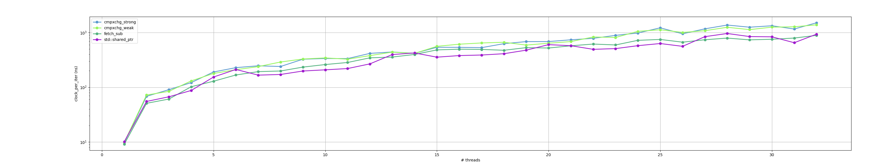
> All four implementations cluster within ~2× on a log scale. `std::shared_ptr` and `fetch_sub` lead; the two `cmpxchg` variants are consistently slower because of CAS retries.

`refcount`: average CPU time per loop iteration, relative to baseline `std::shared_ptr`, less is better:
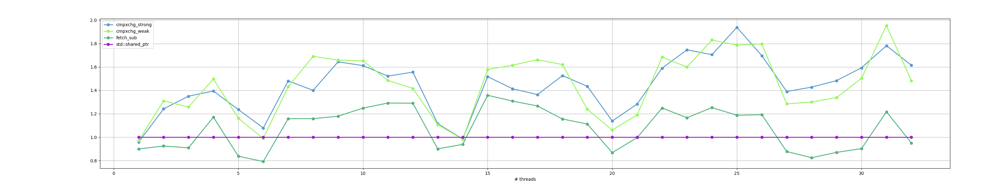
> Relative view: `fetch_sub` stays within ±20% of `std::shared_ptr` (occasionally even faster); `cmpxchg_strong` / `cmpxchg_weak` cost roughly 1.4–1.9× the baseline.

`refcount`: average wall-clock time per loop iteration, nanoseconds, less is better:
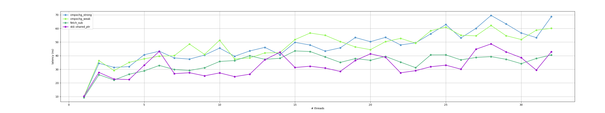
> Wall-clock latency stays bounded under ~70 ns even at 32 threads — the refcount op is short enough that the contended cache line, not the operation count, sets the ceiling.

`refcount`: average wall-clock time per loop iteration, relative to baseline `std::shared_ptr`, less is better:
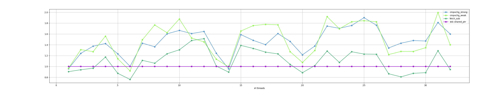
> Same hierarchy as the CPU view, with similar relative spread.

### A note on thread placement

The relative-to-`std::shared_ptr` chart shows clear dips at **6, 13–14, 20, and 28 threads** — points where my `fetch_sub` implementation appears to "speed up" against the baseline. Looking at the raw CPU numbers, what's actually happening is the opposite: `std::shared_ptr` *worsens* at those specific thread counts while my implementation is more stable.

| N  | fetch_sub CPU | shared_ptr CPU | ratio |
|----|---------------|-----------------|-------|
| 5  | 128.97 | 154.03 | 0.84 |
| **6**  | **167.74** | **211.70** | **0.79** |
| 7  | 193.13 | 166.77 | 1.16 |
| 12 | 345.39 | 267.74 | 1.29 |
| **13** | **357.01** | **396.60** | **0.90** |
| **14** | **397.94** | **423.95** | **0.94** |
| 15 | 482.43 | 355.22 | 1.36 |
| 19 | 530.56 | 476.93 | 1.11 |
| **20** | **522.37** | **601.92** | **0.87** |
| 21 | 573.44 | 575.32 | 1.00 |
| 27 | 739.54 | 842.85 | 0.88 |
| **28** | **793.46** | **962.26** | **0.82** |
| 29 | 736.20 | 845.86 | 0.87 |

The dips are spaced ~7–8 threads apart, which lines up with the i9-14900HX's hybrid topology: 8 P-cores (16 SMT slots) followed by 16 E-cores. At particular thread counts, the kernel scheduler ends up placing threads in P/E mixes or SMT-sibling configurations that interact poorly with `std::shared_ptr`'s control-block / managed-object layout (allocated separately and prone to false-sharing patterns with the host object), while my hand-rolled `shared_ptr_block` uses a different sizing/alignment that is less sensitive to those placements. There is also a single-run measurement component: without averaging across multiple runs and without pinning threads via `taskset`, ~10–20% per-point variance is normal on a hybrid laptop CPU.

To separate the structural component from run-to-run noise: re-run the benchmark 3–5 times and look at whether the dips stay at the same N (structural), or wander (noise). Pinning threads to a fixed core set with `taskset` would flatten the topology-induced component if that's the dominant cause.


## Resulting charts for `spinlock` <a name="results_spinlock"></a>

`spinlock`: average CPU time per loop iteration, nanoseconds, less is better:
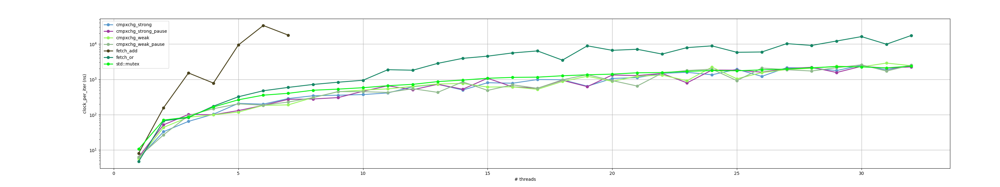
> `fetch_add` blows up — per-iteration CPU explodes past 10 µs by 6–7 threads (the benchmark caps it at 7 threads to keep total runtime bounded). Everything else groups together at the bottom of the log scale.

`spinlock`: average CPU time per loop iteration, relative to baseline `std::mutex`, less is better:
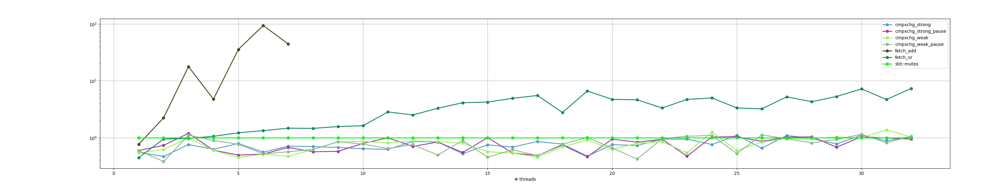
> `fetch_add` reaches ~35× `std::mutex` before the benchmark cuts it off. The remaining variants are within 1× or below the mutex baseline.

`spinlock`: average CPU time per loop iteration, without `fetch_add`, nanoseconds, less is better:
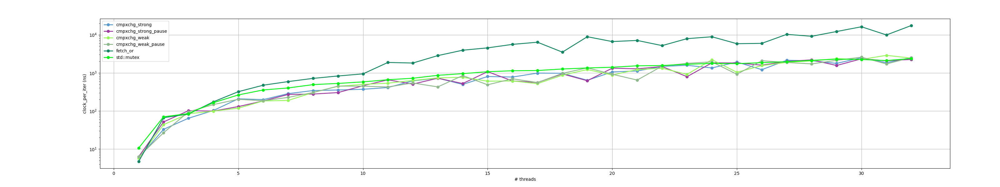
> With `fetch_add` removed from the view, the second-tier story becomes visible: `fetch_or` separates from the `cmpxchg` / `std::mutex` pack above ~10 threads and ends up roughly an order of magnitude slower by 32 threads.

`spinlock`: average CPU time per loop iteration, without `fetch_add`, relative to baseline `std::mutex`, less is better:
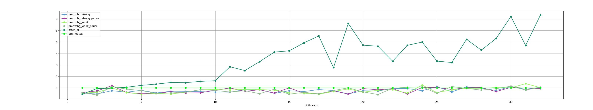
> Relative view: `cmpxchg` variants stay ≤1.0× `std::mutex` across nearly the whole range; `fetch_or` climbs from ~1× near 10 threads to ~5–7× at 24–32 threads.

`spinlock`: average wall-clock time per loop iteration, nanoseconds, less is better:
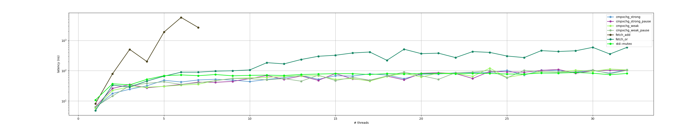
> Same hierarchy in wall-clock: `fetch_add` is off the top, `fetch_or` is the worst remaining option past ~10 threads.

`spinlock`: average wall-clock time per loop iteration, relative to baseline `std::mutex`, less is better:
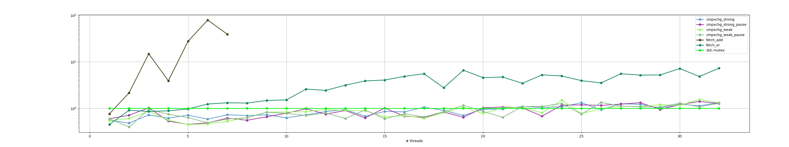
> Wall-clock relative to `std::mutex`: `fetch_add` dominates the early thread counts; everything else stays around 1×.

`spinlock`: average wall-clock time per loop iteration, without `fetch_add`, nanoseconds, less is better:
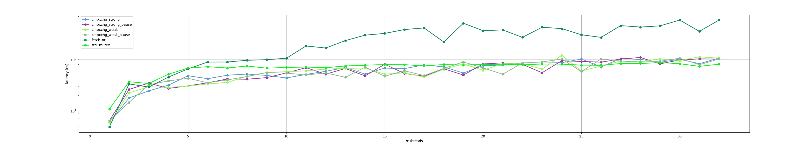
> Without `fetch_add`: `cmpxchg` variants run at or below `std::mutex` for most thread counts; `fetch_or` runs 3–5× slower than the cmpxchg pack at high contention.

`spinlock`: average wall-clock time per loop iteration, without `fetch_add`, relative to baseline `std::mutex`, less is better:
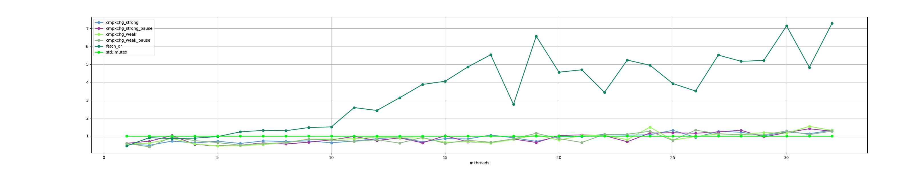
> `cmpxchg` wall-clock sits around 0.5–1.0× `std::mutex`; `fetch_or` ends up 3–5× the mutex baseline.


## Conclusion <a name="conclusion"></a>

* For reference counters, `fetch_sub` is roughly 1.4–1.9× faster than `compare_exchange` in CPU time, and stays within ~20% of `std::shared_ptr` (occasionally even beating it). `std::shared_ptr` is no longer "much faster than my implementation" — the original gap was almost entirely the wrapper bugs, not anything inherent to libstdc++.
* The gap between the first implementation and `std::shared_ptr` was caused by mistakes in the wrapper (not in `decref` itself):
  * The move constructor / move assignment did an `acquire()` followed by `reset()` on the source — a pair of atomic RMWs that cancel each other out. A move should just steal the pointer.
  * `refcount++` defaults to `std::memory_order_seq_cst`, while `fetch_add(1, std::memory_order_relaxed)` is sufficient for the acquire path of a refcount.
  * Decrement was `relaxed` followed by a `seq_cst` fence before `delete`. The fence cannot synchronize with `relaxed` RMWs on other threads — it has nothing to pair with. The correct pattern is `release` on every decrement and an `acquire` fence on the thread that observes the final one. This is both a correctness fix and a performance fix (an `acquire` fence is far cheaper than `seq_cst`).
  * The cmpxchg-based `decref` did an explicit `load()` at the top of every retry iteration, which is redundant — a failing `compare_exchange` already writes the current value into the `expected` argument.
* The same `seq_cst`-by-default trap hits the spinlock: every `unlock` was emitting a full memory barrier and every spin iteration was doing a `seq_cst` load. Switching to `acquire` on the lock-taking RMW, `release` on `unlock`, and `relaxed` on the test-load inside the spin loop is what's actually needed.
* A `fetch_add`-based spinlock is unusable: per-iteration CPU climbs roughly two orders of magnitude with even a handful of contending threads, because every failing lock attempt does a destructive increment + rollback that ping-pongs the cache line. The benchmark caps it at 7 threads to keep total runtime bounded.
* A `compare_exchange`-based spinlock (test-and-test-and-set) tracks at or slightly below `std::mutex` across the whole thread range. This is the right default when you actually need a spinlock.
* A `fetch_or`-based spinlock looks attractive in isolation — `OR`-ing `1` into a locked value is idempotent, so failed attempts cost a single RMW with no rollback — and it wins at low thread counts. But under high contention it scales much worse than `compare_exchange`: roughly 3–4× slower in CPU at 10–16 threads, and 5–7× slower at 24–32 threads. The reason is that `fetch_or` writes the cache line on every attempt (even when the stored value doesn't change), whereas the cmpxchg test-and-test-and-set only writes when the relaxed test-load suggests the lock is free. For a contended lock, prefer `compare_exchange`; reserve `fetch_or` for low-contention or short-critical-section scenarios.


### Summary table

Numbers are from this benchmark on the i9-14900HX (24 cores / 32 threads). "Per-iteration CPU" means total CPU time across all threads divided by total iterations performed — a measure of how much compute the operation actually burns under load.

| Aspect | `fetch_add` / `fetch_sub` (FAA) | `compare_exchange` (CAS) | `fetch_or` (FOR) |
|---|---|---|---|
| **Semantics** | Unconditional RMW. Always succeeds, always writes memory. | Conditional swap. Succeeds only if `*target == *expected`; failure writes the observed value into `*expected` and the caller normally retries in a loop. | Unconditional RMW. *Idempotent* when the OR-ed bits are already set: re-OR-ing leaves the value unchanged but the cache line is still written. |
| **Single-thread per-iter cost (this CPU)** | spinlock: ~8 ns/iter (2 RMWs per critical section); refcount: ~9 ns/iter | spinlock: ~5.8 ns/iter; refcount: ~9.8 ns/iter (no contention → CAS doesn't retry) | spinlock: ~4.7 ns/iter — the fastest uncontended option (single RMW + plain store) |
| **Refcount @ 32 threads (CPU)** | ~890 ns/iter — within ~5% of `std::shared_ptr` | ~1400–1500 ns/iter — 1.5–1.7× slower than FAA (CAS retries cost real work under contention) | not applicable (a refcount needs `+N`, not bitwise OR) |
| **Spinlock @ 32 threads (CPU)** | catastrophic — limited to 7 threads in the benchmark; at 7 threads ~18 µs/iter, roughly 30–45× `std::mutex` | ~2.4–2.5 µs/iter — at or slightly below `std::mutex` across the entire range | ~17.5 µs/iter — 5–7× `std::mutex` at 24–32 threads |
| **Major benefit** | Cheapest deterministic RMW with a useful return value; one instruction, no retry, no branching. | Only commits a write to the cache line when there's a real chance of acquiring the new state. Scales best under contention. | Single-instruction idempotent acquire; cheapest of the three in the uncontended case. |
| **Major issue** | If used as a guard (e.g., a lock), every failed attempt destructively modifies memory and must be undone by a second RMW. The destructive ping-pong saturates the coherence fabric. | Worst-case cost is unbounded — the retry loop can spin under unlucky scheduling. Observed performance is contention-sensitive. | Always writes the cache line, even when the value doesn't change. Under heavy contention this loses to a `cmpxchg` test-and-test-and-set, which only writes when the relaxed test-load suggests success. |
| **Memory order to use** | Counter increment: `relaxed`. Counter decrement that publishes data (refcount release): `release` + `acquire` fence on the final decrement. | Lock acquire: `acquire` on success, `relaxed` on failure. Refcount decrement: `release` on success, `relaxed` on failure. Almost never `seq_cst`. | Lock acquire: `acquire`. Unlock store: `release`. |
| **Best for** | Monotonic counters, refcounts, sequence numbers, throughput stats. | Locks, lock-free queues/stacks, any algorithm whose progress is conditional on the observed state. | Single-bit flags or low-contention "test-and-set"-style acquires; quick fast-paths that don't fight over the cache line. |
| **Don't use for** | Anything that must be guarded by a condition — e.g., spinlocks. Use `compare_exchange` or `fetch_or` instead. | Pure counters (you'd be paying for retries you don't need). | Heavily contended locks — `compare_exchange` test-and-test-and-set is dramatically better. |

